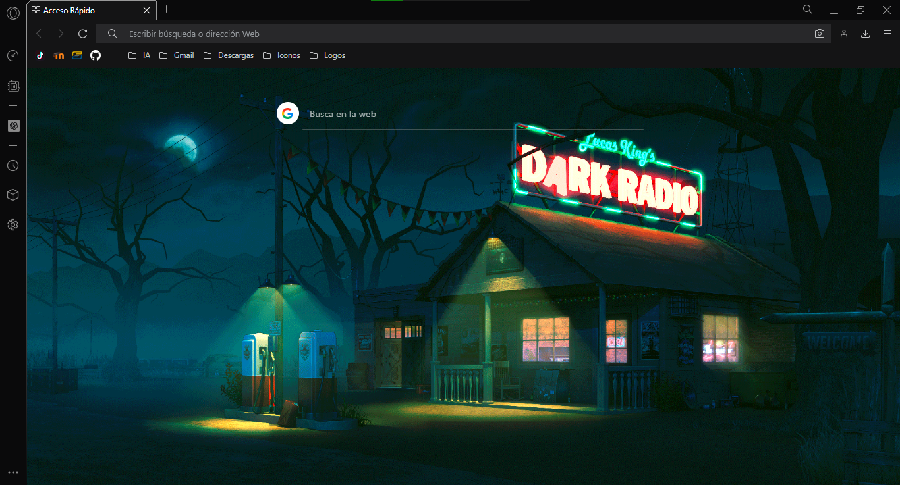

# Mod Opera GX - ShemingRadio

¡Bienvenido al Mod de Opera GX! Este mod ha sido diseñado para mejorar tu experiencia de navegación en Opera GX con características personalizadas, para hacer tu uso del navegador aún más placentero y eficiente.

  

## 🚀 Características
- **Personalización avanzada:** Cambia el aspecto de Opera GX con nuevos temas y opciones de personalización únicas.
- **Interfaz de usuario mejorada:** Diseños y mejoras visuales para una experiencia más atractiva.

## 📥 Instalación
1. **Descargar el Mod:** Descarga los archivos del Mod desde [enlace de descarga].
2. **Copiar los Archivos:** Copia los archivos descargados a la carpeta de configuración de Opera GX.
   - En Windows: `C:\Users\TuUsuario\AppData\Roaming\Opera Software\Opera GX Stable`
   - En macOS: `~/Library/Application Support/com.operasoftware.OperaGX/`
   - En Linux: `~/.config/opera-gx/`
3. **Activar el Mod:** Reinicia Opera GX y ve a la sección de Extensiones para activar el Mod.
4. **Configuración Opcional:** Ajusta las opciones del Mod desde la sección de Configuración.

## 🛠️ Uso
- **Temas:** Accede a los temas personalizados desde la sección "Apariencia" en Configuración.
- **Configuraciones Avanzadas:** Ve a "Configuración > Modificaciones GX" para ajustar todas las nuevas funcionalidades.

## 🐞 Reporte de Errores
Si encuentras algún problema o bug, por favor, repórtalo contáctandome directamente en [miguelantoniomartinezjimenez00@gmail.com].

### Versión 1.0.0
- Lanzamiento inicial del Mod de Opera GX.
- Nuevas funciones de personalización y productividad.
  
## 📄 Licencia
Este proyecto está licenciado bajo la Licencia MIT. Para más información, consulta el archivo LICENSE.

#
**Creado por [MiguelMartinez30 - @DevDarkSonic](https://github.com/Miguel-Antonio-Martinez-Jimenez).** ¡Gracias por usar mi Mod de Opera GX y hacer de tu experiencia de navegación algo único!
